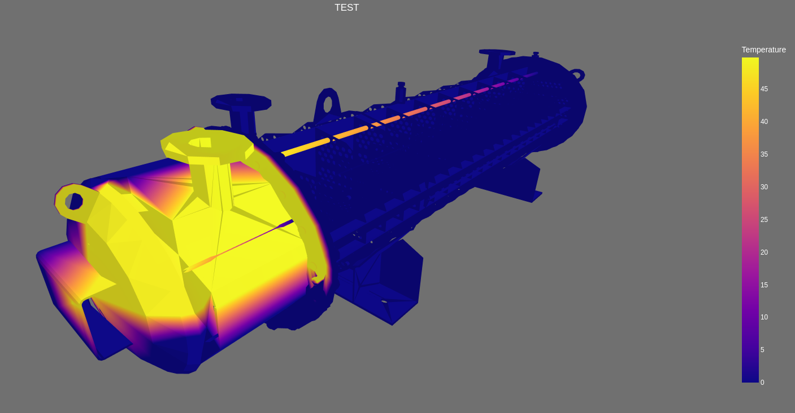

# Визуализация температур

В данном репозитории находится решение [тестового задания.](./task.md)



Для решения воспользовался данными по температурам и функцией для определения
температуры по координатам из приложенного к заданию ноутбука. Функцию использую в коде
для расчета температуры в вершинах исходной модели (находится в директории model). 
Данные по температурам положил в json файл в директории 
[temperature_data.](./temperature_data/temperatures.json) Они используются для расчета.

## Запуск

Приложен файл requirements.txt для установки всех необходимых зависимостей.

Для запуска скрипту необходимо два аргумента:
- Путь к stl модели (в папке model)
- Путь к json файлу с данными (в папке temperature_data)

Также есть необязательный аргумент -o или --opacity, через который можно управлять уровнем opacity:
Float в пределах от 0 до 1. По умолчанию 1.

### Poetry

Я использую poetry ver. 1.3.1, поэтому весю установку и запуск можно сделать через него.

Установка зависимостей:
```commandline
make install
```
Запуск скрипта со всеми нужными аргументами:
```commandline
make start
```
Расшифровка команд в [Makefile](Makefile).